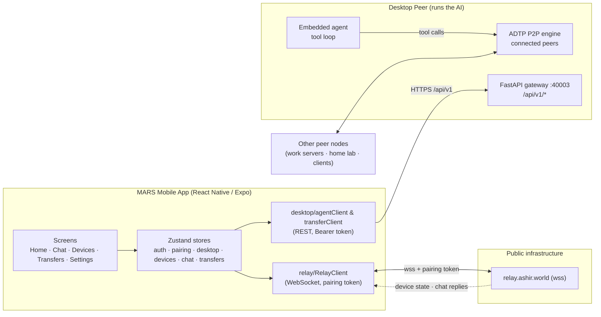
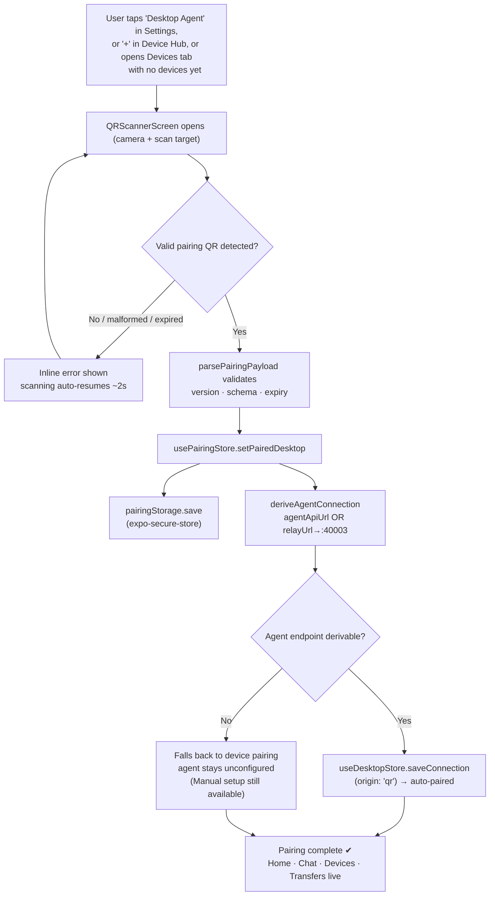
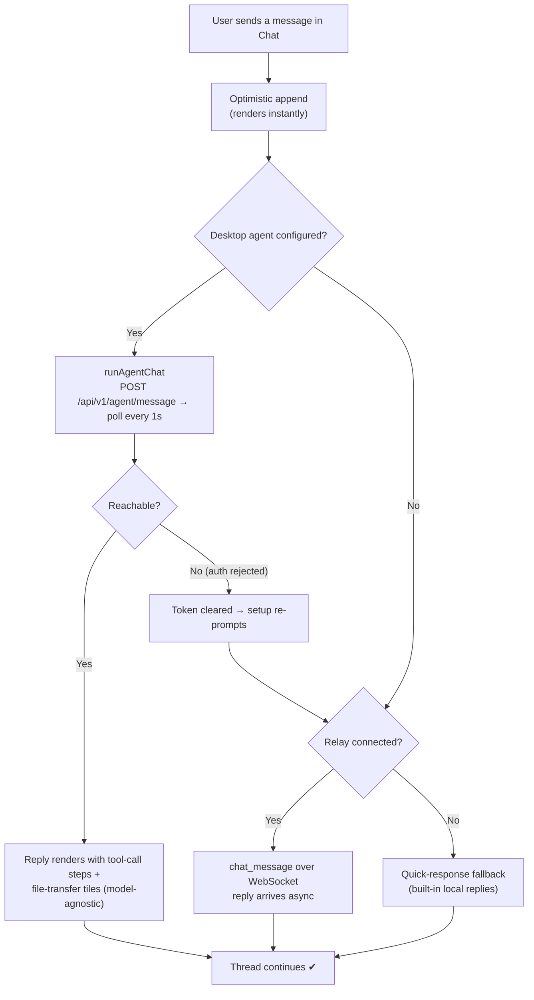

# MARS — Mobile Remote Agent System

> MARS is a React Native (Expo) mobile app that turns your phone into a remote
> co-pilot for the **embedded AI agent running on your desktop**. Scan one QR
> code, and the phone is securely paired — from there you can chat with the
> desktop's agent, watch CPU/RAM on every connected peer, and orchestrate file
> transfers across your fleet, all from the palm of your hand.

---

## Table of Contents

1. [What is MARS?](#what-is-mars)
2. [Architecture & Flowchart](#architecture--flowchart)
3. [Key Features](#key-features)
4. [Tech Stack](#tech-stack)
5. [Repository Layout](#repository-layout)
6. [Getting Started](#getting-started)
7. [Using the App](#using-the-app)
8. [Security Model](#security-model)
9. [Testing & CI/CD](#testing--cicd)
10. [Roadmap — How MARS Can Be Used in the Future](#roadmap--how-mars-can-be-used-in-the-future)

---

## What is MARS?

MARS is the **production mobile frontend** for a peer-to-peer agent network built
around the ADTP protocol (Advanced Data Transfer Protocol). The heavyweight work
happens on the desktop side:

- An **embedded AI agent** (OpenAI / Anthropic / **locally via Ollama** — model-agnostic)
  with a tool loop that can `send_file`, `list_peers`, `watch_folder`, `shell_exec`, and more.
- A **FastAPI REST gateway** on port `40003` (`/api/v1/*`) with Bearer-token auth.
- A **relay** endpoint (`wss://`) for real-time push of device state and chat replies.

The **phone has no heavy endpoint of its own.** It is a thin, secure remote:
it talks HTTPS to the desktop's REST gateway and keeps a lightweight WebSocket open
to the relay for live updates. Scan a pairing QR → the app derives the agent API
endpoint automatically → the desktop is configured as the "Desktop Agent" in one step.

> Implementation status: **Phase 14.** See [`Phases/`](Phases) for the chronological
> build docs (PHASE_1_SPLASH … PHASE_12_MODEL_AGNOSTIC_CHAT) and
> [`docs/`](docs) for the full ADTP handoff + build specs.

---

## Architecture & Flowchart

### 1. System overview



The desktop does the real work — running the model, executing tools, talking to
peers over P2P. The phone renders state, issues commands, and surfaces results.

### 2. QR pairing flow (the single-step setup)



Scanning is locked after the first valid read (no duplicate-fire), camera access is
released on unmount, and the pairing token is **never logged** in release builds.

### 3. Chat routing decision



This keeps a single, predictable flow: **desktop agent first, relay second,
offline fallback last** — and the user is never left staring at a spinner.

---

## Key Features

### One-Scan Pairing
- Scan the desktop's pairing QR → the app validates it (schema, version, expiry),
  persists it in **SecureStore**, and **auto-configures the Desktop Agent** — the
  agent endpoint either ships in the QR or is derived from the relay URL + pairing
  token (port `40003`). No manual URL entry required.
- If the code can't configure an agent, it still records the device pairing — the
  same scanner powers "add device" in the Device Hub.

### Agent Chat (Model-Agnostic Co-Pilot)
- Natural-language control of the desktop's embedded agent: *"send
  `report.pdf` to DEV-034"*, *"list my peers"*, *"what's the CPU on the home lab?"*
- The phone never branches on which model answered — OpenAI, Anthropic, or a local
  **Ollama** model all render identically; the provider is display-only metadata.
- Tool calls render as step cards; `send_file`/`receive_file` calls become file tiles.

### Real-Time Relay Connection
- Lightweight WebSocket to the relay with **exponential backoff reconnect**,
  token authentication, and clean teardown. Device `state_update`s hydrate the
  stores live; `chat_response`s update both Home previews and the chat thread.

### Command Center (Home)
- Searchable device grid, online/total counts, top-4 device spotlight, recent chat
  previews, and a custom scrollbar — dark "Blue Eclipse" orb aesthetic throughout.

### Device Hub
- 2-column grid of node cards: OS, status pill, **CPU % + RAM % bars**, last check.
- Rename/remove devices; tap **+** to scan a new pairing QR.

### Transfers
- Live view of incoming/outgoing transfers (`queued` → `negotiating` →
  `transferring` → `completed`/`failed`) with byte counts, peer IDs, and status
  tone pills — polled from the desktop REST gateway.

### Accounts & Privacy
- OAuth sign-in — **Google, GitHub**, session persisted in
  SecureStore; sign-out leaves pairing untouched.
- Dedicated **Privacy & Security** screen: what data is collected, payment
  handling, retention, third-party services, and in-app legal documents.

### Donations (Flutterwave)
- In-app donations in **USD or NGN** ,
  real-time transaction verification and success state.

### Settings
- Profile header, paired-device count, **Desktop Agent** connection (QR scan or
  manual URL + token, test-before-save, disconnect), Privacy & Security, Support,
  and an animated sign-out flow.

---

## Tech Stack

| Layer | Choice |
|---|---|
| Framework | **Expo SDK 54** · **React Native 0.81** · React 19.1 · TypeScript (strict) |
| Navigation | Custom tab navigator + `PagerTabView` (`src/navigation/`) |
| State | **Zustand** stores (`src/store/`) |
| Auth | `expo-auth-session` · Google / GitHub OAuth · `expo-apple-authentication` |
| Secure storage | `expo-secure-store` (session · pairing token · agent token) |
| Camera | `expo-camera` `CameraView` with QR barcode scanning |
| Realtime | Native `WebSocket` relay client with backoff |
| Charts/UI | `react-native-reanimated` · `expo-haptics` · custom SVG icons |
| Payments | `flutterwave-react-native` |
| Fonts | Audiowide · Quantico · Offside · Montserrat |
| Tests | **Jest** (jest-expo) + `tsc --noEmit` |

---

## Repository Layout

```
.
├── mobile/                  # The Expo / React Native app (this repo's product)
│   ├── App.tsx              # Splash crossfade + store restore on launch
│   ├── app.json             # Expo config (world.ashir.mars)
│   └── src/
│       ├── screens/         # Splash · SignIn · Home · Chat · Devices/DeviceHub
│       │                    # QRScanner · Transfers · Settings/Profile · Privacy
│       │                    # Donate · Support
│       ├── navigation/      # RootNavigator · TabNavigator · tabConfig · PagerTabView
│       ├── store/           # zustand: auth, pairing, desktop, devices, chat,
│       │                    #   chatSession, transfers, connection, notification prefs
│       ├── desktop/         # agentClient (REST) · agentChat (post→poll) ·
│       │                    #   transferClient · desktopStorage · types · errors
│       ├── pairing/         # parsePairingPayload · deriveAgentConnection ·
│       │                    #   pairingStorage · types
│       ├── relay/           # RelayClient (WS) · useRelayConnection ·
│       │                    #   appContext · fallbackChatClient
│       ├── auth/            # google/google/github/apple providers · sessionStorage
│       ├── components/      # reusable UI primitives + icons
│       ├── donation/        # Flutterwave reducer, tx-ref, verification
│       ├── theme/           # colors · typography · spacing · glass
│       ├── data/            # mock devices / chats (real data replaces them on relay)
│       └── types/           # device · chat · chatMessage · desktop ...
├── Phases/                  # PHASE_1 … PHASE_12 build/spec docs (feature chronology)
├── docs/                    # ADTP handoff + Phase 14 build specs
├── temp/ assets/            # design assets (orb, logos, fonts)
└── .github/workflows/       # mobile-ci.yml — CI gate (see below)
```

---

## Getting Started

```bash
# From the mobile/ directory
npm install                 # (repo root has no package.json — everything lives in mobile/)

npm run typecheck           # tsc --noEmit — strict TS check
npm test                    # jest (106 tests / 26 suites)

npx expo start              # Metro dev server → scan with Expo Go
npx expo run:ios            # native iOS build
npx expo run:android        # native Android build
```

Environment: configure auth credentials and Flutterwave keys via
`mobile/.env` / `.env.example` (e.g. `EXPO_PUBLIC_FLUTTERWAVE_PUBLIC_KEY`).

---

## Using the App

1. **Sign in** with Google, GitHub, or Apple.
2. **Pair** — tap **Desktop Agent** in Settings (or `+` in the Device Hub) and scan
   the desktop's pairing QR. The agent auto-pairs; the same scan records the device.
3. **Chat** — ask the co-pilot anything. It routes to the desktop agent (tool calls
   visible), falls through to the relay, then to quick responses offline.
4. **Devices** — watch CPU/RAM live in the Device Hub; rename/remove nodes.
5. **Transfers** — monitor outgoing/incoming file jobs from your desktop.
6. **Settings** — disconnect the agent (QR again or manual URL + token), review
   Privacy & Security, support the project via Donate.

---

## Security Model

- **No secrets in plain storage.** Session, pairing payload, and agent token all
  live in `expo-secure-store` (iOS Keychain / Android Keystore).
- **Validated pairing payloads.** `parsePairingPayload` rejects malformed JSON,
  missing fields, unknown versions, and **expired** codes — scanning never trusts
  raw camera output.
- **Bearer-token REST.** Every `/api/v1/*` call injects the token; timeouts map to
  typed errors; a **401/403 clears the agent token** and re-prompts setup.
- **Pairing token discipline.** Never logged in release builds; relay distinguishes
  `auth_ack` / `auth_rejected` and stops reconnecting on rejection.
- **Least-privilege defaults.** The phone carries no P2P keys — it's a credentialed
  remote to your own desktop, which enforces its own permission store (`BLOCKED_COMMANDS`,
  path allow-lists) before any tool executes.

---

## Testing & CI/CD

- **Jest (jest-expo)** — 26 suites / 106 tests covering pure logic (pairing parser,
  agent derivation, relay client, chat routing, stores, selectors) and components.
- **`tsc --noEmit`** — strict type gate.
- **GitHub Actions** (`.github/workflows/mobile-ci.yml`): runs on every PR and every
  push to `main`, and **`main` is branch-protected** — the `mobile-tests` check must
  pass before any merge (strict: branch must be up-to-date; admin bypass disabled).

---

## Roadmap — How MARS Can Be Used in the Future

MARS is built as a thin remote so the roadmap is mostly about **what the desktop
agent learns to do** — the phone inherits it automatically:

- **Fleet ops co-pilot.** Ask the agent to health-check every server, patch
  hosts, or push artifacts to many peers — one conversation commands the fleet.
- **True remote control.** As the desktop gains more tools (`shell_exec`, file
  orchestration, watchers), MARS becomes a full terminal-grade remote from the
  phone — with **biometric unlock** (Face ID / fingerprint) already planned as the gate.
- **Private, offline AI.** With an Ollama-backed agent the pair (phone ↔ desktop)
  is fully self-hosted — your data never leaves your machines, at home or office.
- **Push notifications.** When the desktop notifies the app (transfers done, agent
  finished a long task, a peer came online), MARS can wake the user instead of them
  polling.
- **Multi-session & multi-desktop chat** (the relay + pairing stores already model
  per-desktop identities; the UI is stubbed to a single session today).
- **Device Hub depth.** Collections/tabs, node detail drill-down, and live CPU/RAM
  history charts on top of the existing metrics contract.
- **Monetization.** The Flutterwave donation flow can grow into subscriptions or a
  marketplace of agent skills without touching the pairing model.
- **Stage-1 PWA parity.** The same API contract & screen structure already port to a
  web build (`npx expo run:web`) — one backend, every pocket.

